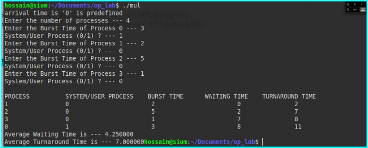
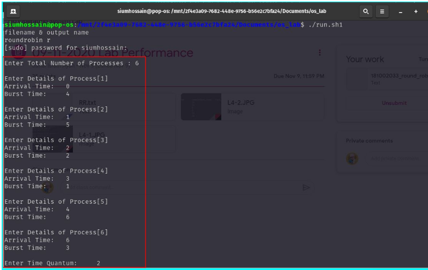
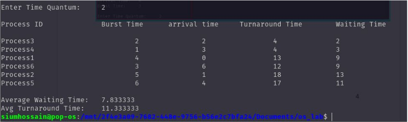

# Multilevel queue sheduling algorithm

Another class of scheduling algorithms has been created for situations in which processes are easily classified into different groups.

<strong>Output</strong>

# Round robin scheduling algorithm
Round Robin is a CPU scheduling algorithm where each process is assigned a fixed time slot in a cyclic way. 
**Output**

